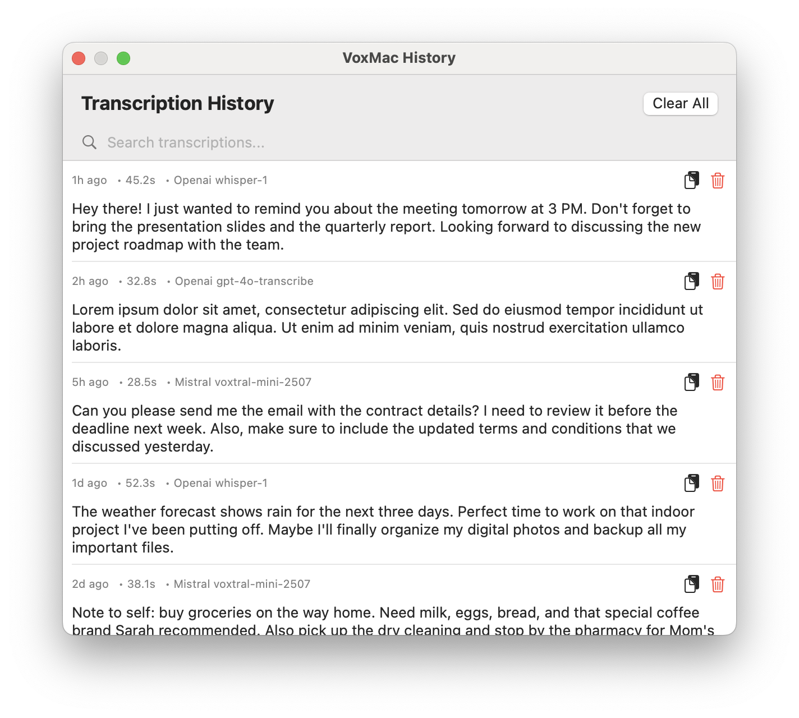
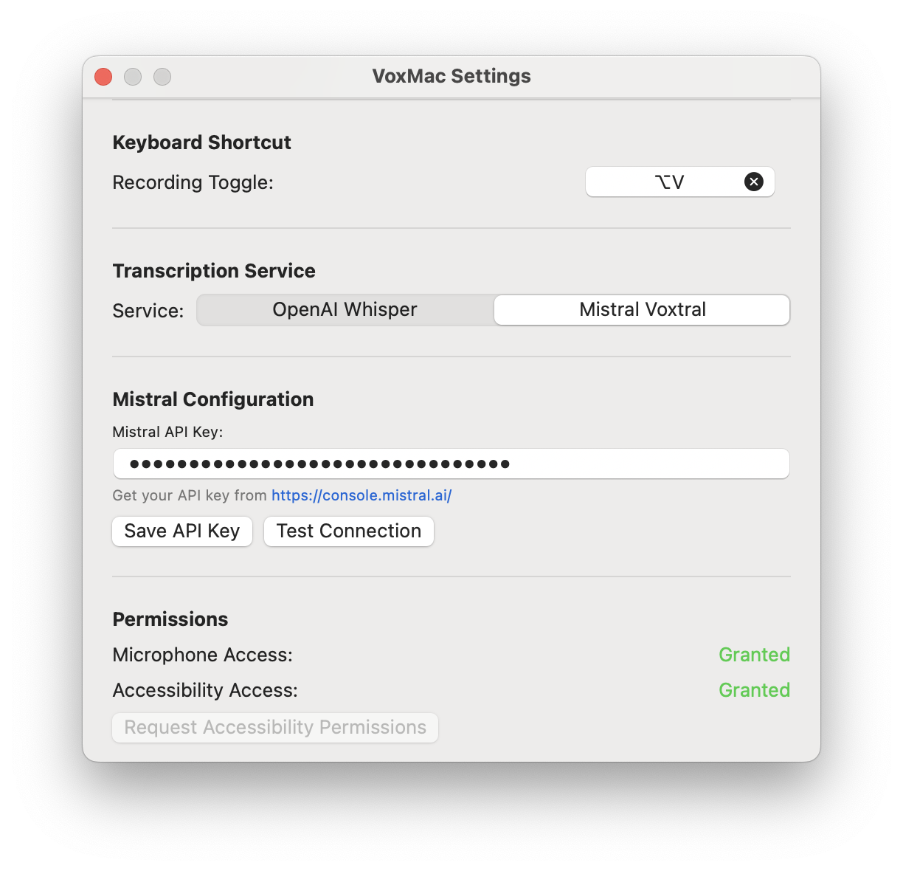

# VoxMac

A native macOS app for speech-to-text transcription. Record audio with a global keyboard shortcut, transcribe it using OpenAI Whisper or Mistral Voxtral, and insert text into any active app. Features a minimal menu bar UI, customizable settings, and transcription history.

## Features

- **Global Keyboard Shortcut**: Toggle audio recording with a customizable hotkey .

- **Speech-to-Text Transcription**: Supports OpenAI Whisper and Mistral Voxtral APIs.

- **Text Insertion**: Automatically inserts transcribed text at the cursor position using Accessibility APIs.

- **Menu Bar Interface**: Displays recording status and provides quick access to settings and history.

- **Settings**: Configure API keys, transcription service, insertion method, and keyboard shortcut.

- **Transcription History**: View, copy, or delete past transcriptions with search functionality.

- **Onboarding**: Guides users through initial setup, including microphone and accessibility permissions.

